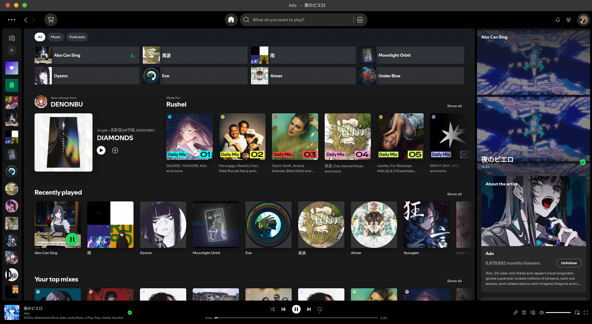
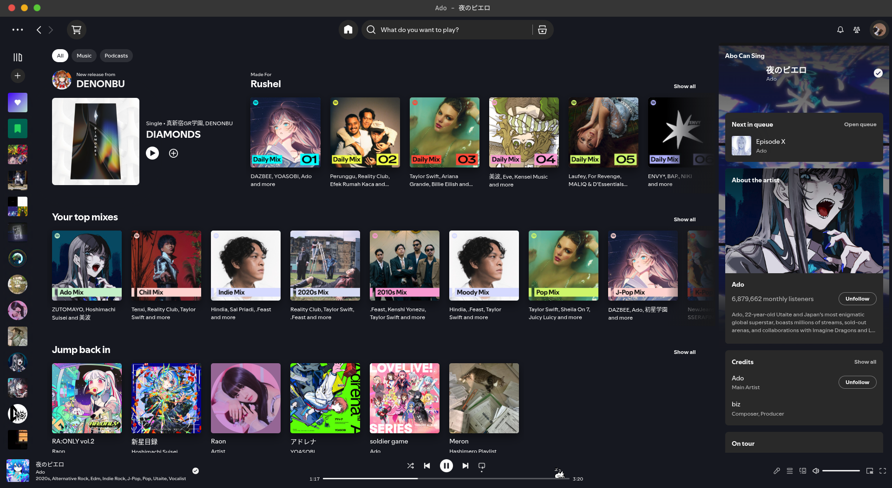
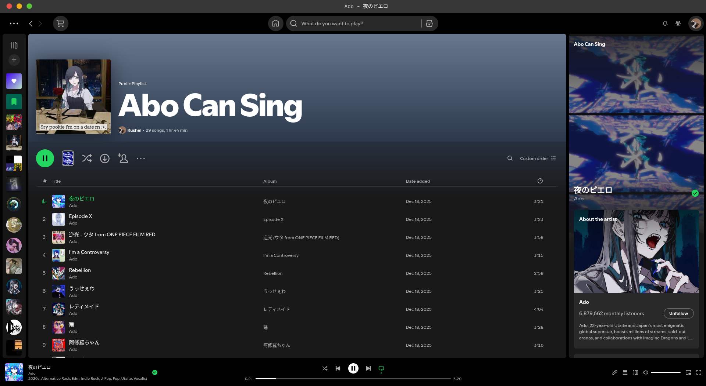
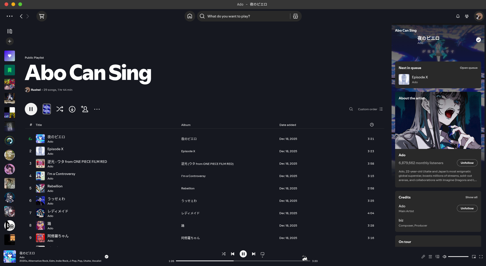
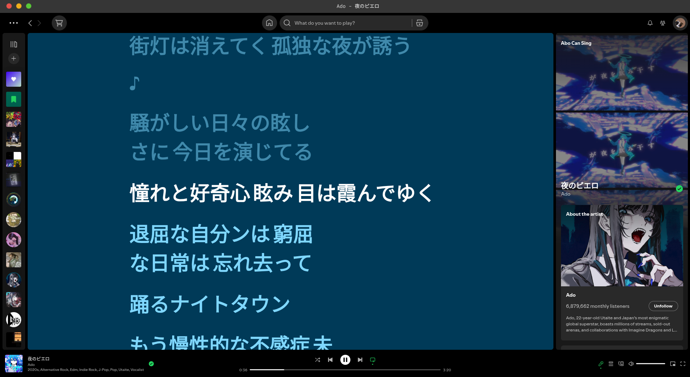
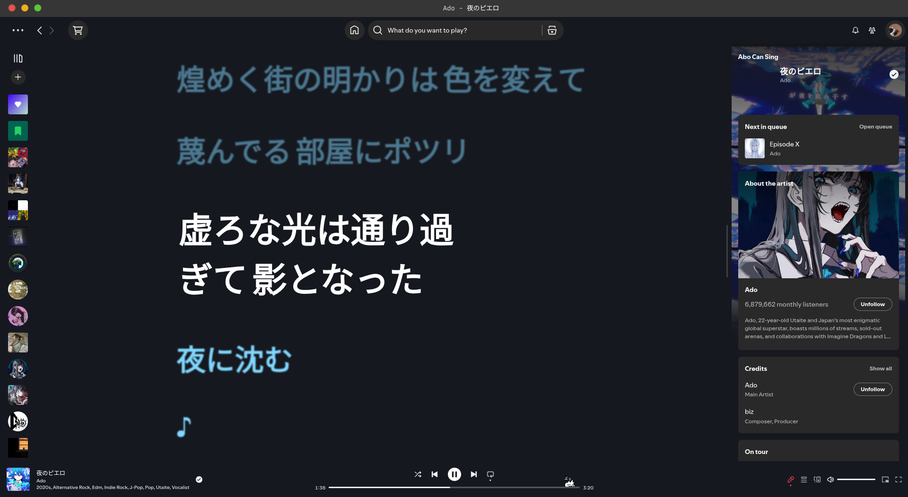

# my-spicetify-snippets

Collection of Spicetify CSS snippets to customize your Spotify desktop client. These snippets are tested with the `Blacksuan19` theme.

## Contents

- `index.css` — combined stylesheet with all tweaks.
- `snippets/` — per-tweak files (one file per tweak).
- `preview/` — contains before and after screenshots for visual comparison.

## Usage

1. Open the [Spicetify Marketplace](https://spicetify.app/).
2. Go to the **Themes** tab and download the default `Blacksuan19` theme.
3. Navigate to the **Snippets** tab.
4. Click **Add CSS** at the bottom-right of the section.
5. Copy the contents of `index.css` from this repository and paste it into the editor.

To disable a tweak, remove or comment out its block from the custom CSS and re-run the apply command.

## Snippets

- `01-better-lyrics.css` — emphasize the active lyric line.
- `02-hide-sidebar-scrollbar.css` — hide left sidebar scrollbar handles/tracks.
- `03-modern-scrollbar.css` — thin, rounded scrollbar that widens on hover.
- `04-pretty-lyrics.css` — hide lyrics background; fade non-active lines.
- `05-oneko.css` — animated sprite on the playback progress bar (external GIF).
- `06-smaller-right-cover.css` — shrink right-side cover art and compact layout.
- `07-remove-top-gradient.css` — remove header/playlist background gradients.
- `08-hide-recently-played.css` — hide "Recently played" and home shortcuts sections.
- `09-queue-top-side-panel.css` — move queue to the top of the right-side panel.
- `10-remove-playlist-cover.css` — hide large playlist/album cover in headers.

## Preview

Below are the visual previews of the tweaks applied. Each set of images shows the **before** and **after** states for different sections of the Spotify client.

### Home View
**Before:**

**After:**

---

### Playlist View
**Before:**

**After:**

---

### Lyrics View
**Before:**

**After:**

These previews demonstrate the effects of various tweaks, such as smaller right-side cover art, adjusted lyrics styling, removed top gradient, and repositioned queue side panel.
